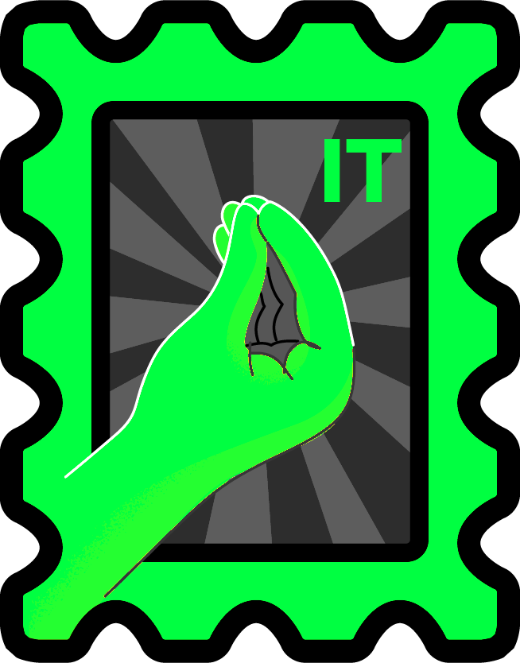
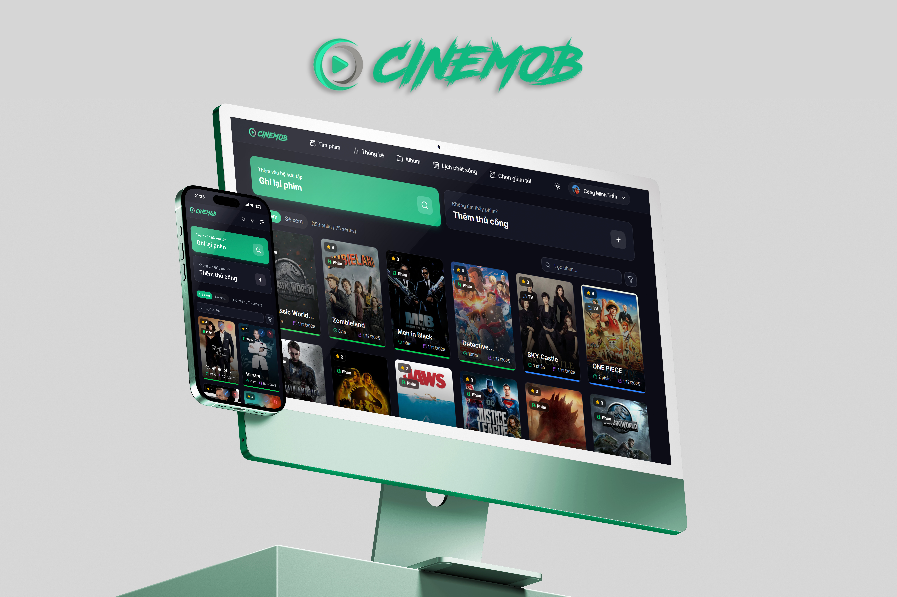
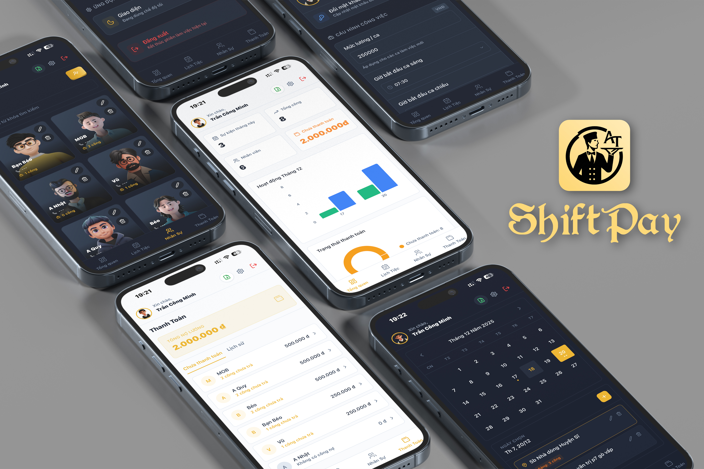
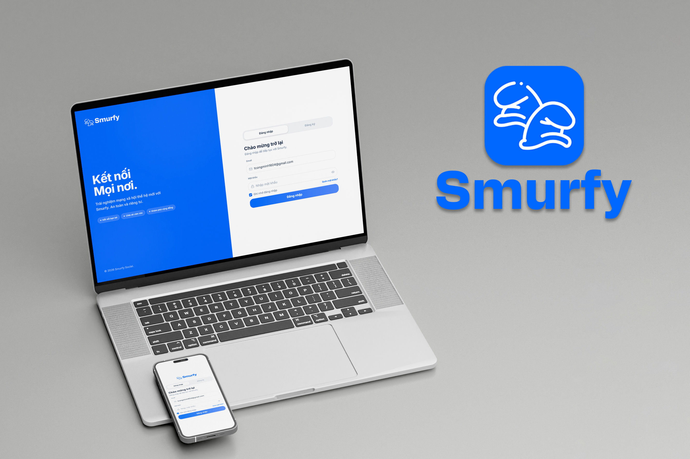

<div align="center">
  
  
  <h1>Mob Portfolio - Personal Showcase</h1>
  
  <p>
    
    
    
    
  </p>

  <p>Một trang web portfolio hiện đại, tối giản và chuyên nghiệp được xây dựng bằng Next.js 15.</p>

<a href="https://mob-portfolio-sand.vercel.app/"><strong>🚀 Xem bản Live Demo</strong></a>

</div>

---

## 🚀 Giới thiệu

**Mob Portfolio** là dự án trang web cá nhân được thiết kế để giới thiệu kỹ năng, dự án và kinh nghiệm làm việc một cách trực quan và ấn tượng. Trang web tập trung vào trải nghiệm người dùng với các hiệu ứng chuyển động mượt mà và giao diện responsive hoàn hảo trên mọi thiết bị.

## 🛠️ Công nghệ sử dụng

Dự án được xây dựng dựa trên các công nghệ hiện đại nhất:

- **Framework:** [Next.js 15](https://nextjs.org/) (App Router)
- **Ngôn ngữ:** [TypeScript](https://www.typescriptlang.org/)
- **Styling:** [Tailwind CSS 4](https://tailwindcss.com/)
- **Animations:** [Framer Motion](https://www.framer.com/motion/)
- **UI Components:** [Shadcn UI](https://ui.shadcn.com/) & [Lucide React](https://lucide.dev/)
- **Quản lý dữ liệu:** Dữ liệu tập trung tại `lib/data.ts` giúp dễ dàng cập nhật nội dung.

- **Clean Architecture:** Cấu trúc thư mục rõ ràng, dễ bảo trì và mở rộng.

## 📱 Dự án tiêu biểu

| Dự án        | Mô tả                                  | Công nghệ                  | Demo                                               |
| :----------- | :------------------------------------- | :------------------------- | :------------------------------------------------- |
| **CineMOB**  | Movie Tracker thông minh tích hợp AI.  | React, Firebase, AI        | [Link](https://cinematrics-e0231.firebaseapp.com/) |
| **ShiftPay** | Hệ thống quản lý nhân sự & bảng lương. | React, Firebase, VietQR    | [Link](https://at-shiftpay.web.app/)               |
| **Smurfy**   | Mạng xã hội thời gian thực.            | React, Firebase, ZegoCloud | [Link](https://smurfy-138c1.web.app/)              |

<p align="center">
  
  
  
</p>

## 💻 Hướng dẫn cài đặt

### Yêu cầu hệ thống

- [Node.js](https://nodejs.org/) (phiên bản 18 trở lên)
- [npm](https://www.npmjs.com/) hoặc [yarn](https://yarnpkg.com/)

### Các bước thực hiện

1. **Clone repository:**

   ```bash
   git clone https://github.com/dexter826/mob_portfolio
   cd mob_portfolio
   ```

2. **Cài đặt thư viện:**

   ```bash
   npm install
   ```

3. **Cấu hình môi trường:**
   Sao chép tệp `.env.example` thành `.env.local` và cập nhật các biến cần thiết:

   ```bash
   cp .env.example .env.local
   ```

4. **Chạy dự án ở chế độ phát triển:**
   ```bash
   npm run dev
   ```
   Mở [http://localhost:3000](http://localhost:3000) trên trình duyệt để xem kết quả.

## 📁 Cấu trúc thư mục

- `app/`: Chứa các route và layout chính của ứng dụng.
- `components/`: Các thành phần UI và các section của trang web (`Hero`, `About`, `Projects`,...).
- `hooks/`: Các custom hooks dùng chung.
- `lib/`: Chứa dữ liệu (`data.ts`) và các hàm tiện ích (`utils.ts`).
- `public/`: Chứa các tài nguyên tĩnh như hình ảnh, icons.

## 🌐 Triển khai

Dự án được tối ưu hóa để triển khai trên nền tảng **Vercel**:

1. Đẩy mã nguồn lên GitHub.
2. Truy cập [Vercel](https://vercel.com/) và import repository này.
3. Cấu hình biến môi trường `APP_URL` trong Settings của Vercel.
4. Nhấn **Deploy**.

---

Thiết kế và phát triển bởi **DEXTER826**.
